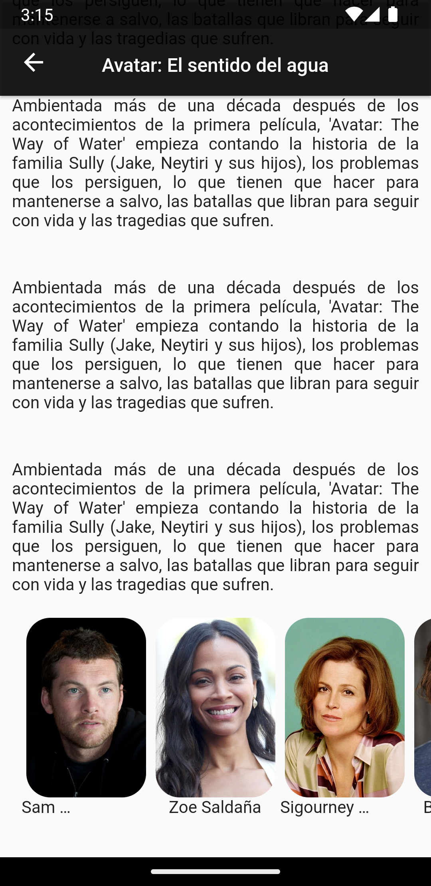

# Film Me

Project created to practice with the use of API's in Flutter. This application despite looking basic is very complete.
Among its features it has things like:

- Image carousel
- Hero Animation
- Movie search engine
- Using The Movie DB API

  
  
  
  

